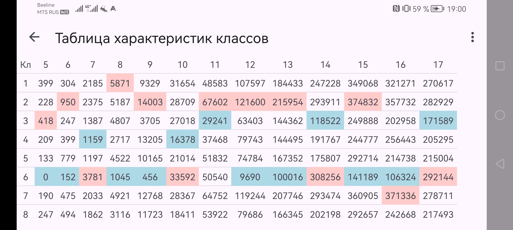
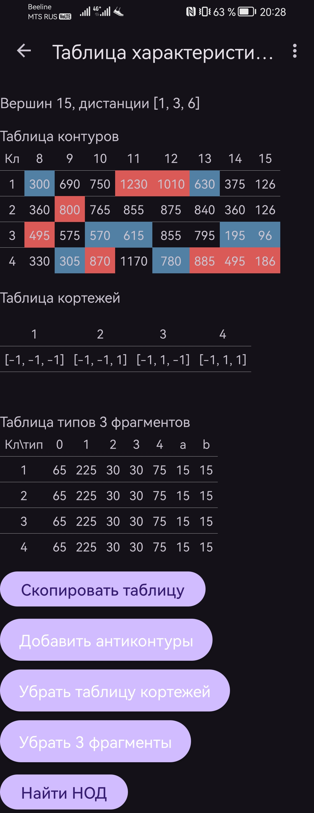

# АфинаГраф

АфинаГраф — это Android-приложение, которое позволяет исследовать графы, получая все ориентации циркулянта на основе выбранных параметров, таких как количество вершин и набор дистанций.

## Основные возможности:

1. Выбор количества вершин графа (N).
2. Ввод матрицы: Матрица Зейделя или кодирующий вектор циркулянта.
3. Задание ориентаций циркулянта и их распределение по классам.
4. Определение длины контуров для анализа.
5. Настройка диапазона дистанций от 3 до (N-1)/2.
6. Формирование таблицы контуров с выделением максимальных и минимальных значений.
7. Получение таблицы контуров и антиконтуров с различной цветовой маркировкой.
8. Возможность копирования таблицы одним нажатием.
9. Вычисление НОД для каждого столбца таблицы.
10. Генерация таблицы кортежей для каждого класса.
11. Получение таблицы 3 фрагментов для каждого класса.
12. Доступ к информации о версии приложения и разработчике.

С АфинаГраф вам больше не нужно вручную выполнять сложные вычисления — приложение сделает всё за вас!

